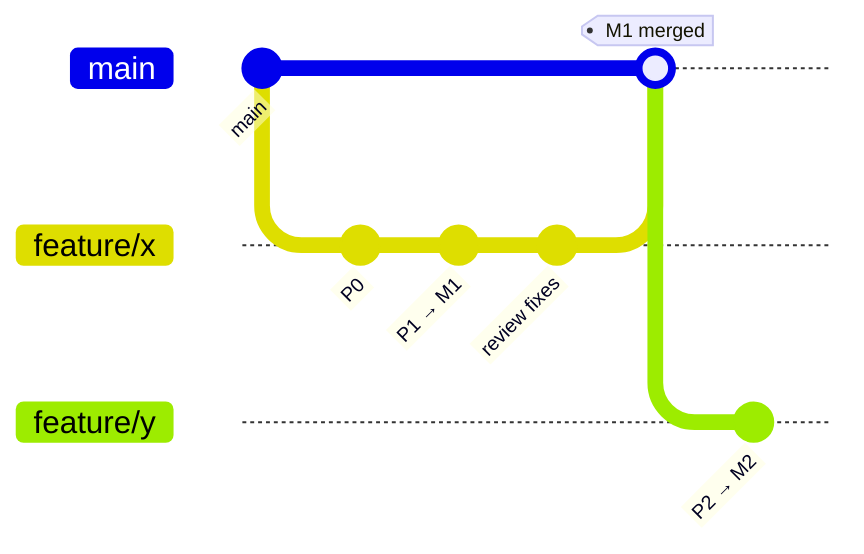

# Methodology — the lifecycle, artifacts, and rules

This is how we take a project from an idea to shipped, reviewed code. It is
documentation-first and evidence-driven: every build traces to a written proposal, and
every claim traces to a reproducible measurement.

---

## 1 · The artifact pipeline

Each stage produces a durable artifact in `docs/`. Later stages reference earlier ones
(provenance), so anyone can walk from shipped code back to the vision that motivated it.

| # | Stage | Artifact | Format | Answers |
|---|-------|----------|--------|---------|
| 1 | **Vision** | `BLOG_<topic>.html` | HTML | Why this? For whom? What changes? |
| 2 | **Proposal** | `<NAME>_RFC.html` | HTML (slides) | What do we assemble / build / avoid? Key decisions? Phased plan? |
| 3 | **Requirements** | `<NAME>_DRP.md` | Markdown | Detailed requirements, constraints, acceptance criteria, non-goals |
| 4a | **Design** | `<NAME>_ARCHITECTURE.html` | HTML | How is it built? Components, data model, boundaries |
| 4b | **Change** | `<NAME>_CHANGE_REQUEST.md` | Markdown | A scoped change on top of an existing architecture |
| 5 | **Plan** | `<NAME>_WORK_PLAN.md` | Markdown | Phases → milestones (M1…) → tasks, with **test gates** |
| 6 | **Milestone review** | `<NAME>_CODE_REVIEW.md` | Markdown | Findings by severity (C/H/M/S) for the milestone's diff |
| 7 | **Checkpoint** | `PROJECT_REVIEW_<date>.md` | Markdown | Project-level health; prioritized open findings; `✅ FIXED` tracking |
| — | **Running log** | `DECISIONS.md` | Markdown | Every non-trivial choice + rationale (ADR-lite) |
| — | **Map** | `DOCS_INDEX.md` | Markdown | Index of everything in `docs/` |

Templates for all of these live in [`templates/`](templates/).

### How the stages connect

- A **BLOG** can spawn one or more **RFCs**. An RFC always cites its BLOG.
- **ARCHITECTURE** is written once per system; **CHANGE-REQUEST** is used for every change
  after the architecture exists (it references the architecture section it touches).
- The **WORK PLAN** turns the DRP + architecture into phases and milestones. Nothing gets
  built that isn't a task in the plan.
- Each **milestone** ends with a **CODE REVIEW**; the project periodically gets a
  **CHECKPOINT REVIEW**.

### RFC & DRP are a coupled pair (not a strict hand-off)

The RFC (approach) and DRP (detail) depend on each other, so **co-author them** — this is
the default. The invariant is only that *approach and detailed requirements are agreed
together **before** the WORK PLAN*; how you get there is a size/fidelity choice:

| Mode | When | How |
|------|------|-----|
| **Parallel / co-authored** ★ | Most real work — approach and detail are entangled | Draft both together: **RFC leads on approach** (assemble/build/avoid, decisions), **DRP leads on detail** (testable requirements, acceptance criteria). One review covers both. |
| **Sequential** (RFC → DRP) | Approach is contested; you want cheap sign-off first | Get the RFC agreed, then write the DRP for the agreed direction |
| **Merged** | Small feature | One RFC with a "Detailed requirements" section; skip the separate DRP |

Cross-check continuously: a requirement no approach satisfies cheaply → revisit the RFC; an
approach that drops a requirement → fix the DRP. Log any direction change in `DECISIONS.md`.

---

## 2 · The rules that make it work

These are the parts people skip that cause the method to fail. They are not optional.

### R1 — Docs before code
No build starts without an RFC/DRP and a work-plan task. If you discover work mid-build,
add it to the plan first (a one-line task is fine) so the plan stays the source of truth.

### R2 — Every claim is measured
Any statement about performance, accuracy, latency, cost, or "X is better than Y" ships
with a **reproducible harness** in `scripts/` (or `scripts/<name>_bench/`) and the numbers
in the doc. If you can't measure it, mark it a **hypothesis**, not a finding. Prefer an
honest null result ("parity") over an unverified win.

### R3 — Every milestone has test gates
A milestone is not "done" because the code exists. It's done when its **test gate** passes —
an explicit, listed set of tests/assertions in the work plan. Gates are written *with* the
milestone, not after.

### R4 — Review before advancing
Run a code review at the end of each milestone before starting the next. Findings are
triaged by severity (Critical / High / Medium / Security) and either fixed or logged as an
open finding in the next checkpoint.

### R5 — Branches, and never merge to main unverified
Work on `feature/<name>` branches. Do not merge to `main` until the milestone's gate passes
and the review is clean. Commit and push only when the human asks. The full flow — branch,
commit, push, PR, merge — is **§3 · The GitHub cycle**.

### R6 — Docs are honest and current
The **final** doc describes the destination, not the journey — remove cancelled ideas and
detours (keep those in `DECISIONS.md` if they carry a lesson). Every "today" claim is read
from the repo as it stands. When a measurement corrects an earlier belief, fix the doc.

### R7 — Decisions are logged, not re-litigated
When a non-trivial choice is made (or reversed), add an entry to `DECISIONS.md` with the
context, options, choice, and why. This prevents re-opening settled questions.

### R8 — Persist what's non-obvious
Keep project memory (goals, constraints, decided calls, gotchas) that isn't derivable from
the code or git history. Don't persist what the repo already records.

### R9 — In planning, ask when unsure — with options
During the **planning stages** (initial discussion, RFC, DRP) don't guess at ambiguous
scope, requirements, or approach. **Ask the person a clear question and present suggested
options** — recommended one first, each with its trade-off — so they can choose fast instead
of writing prose. Resolve the ambiguity *before* finalizing the artifact, and record the
chosen answer in `DECISIONS.md`. Guessing is cheapest to fix here and most expensive to fix
later — so this is where questions pay off most. (In the build stages you act on the decided
spec; if a genuine ambiguity surfaces there, add it to the plan and, if it changes direction,
ask.)

### R10 — Design docs name the layout, the libraries, and what already exists
Every architectural artifact (RFC, DRP, ARCHITECTURE, CHANGE_REQUEST) must carry two
concrete sections, not prose gestures at them:

1. **Code file-system layout** — the directory tree as it will exist, with what each path
   owns. A reader should know where a new file goes without asking.
2. **External libraries** — every proposed dependency by name, with version/pin, what it's
   for, and why it over the alternative. Unlisted dependencies don't get added mid-build;
   they go through the plan (R1).

Two conditions attach to this:

**Python projects — ask which dependency manager.** Never assume. Ask (R9-style, with
options): **conda** is the house default; `uv`, `poetry`, and `pip` + `venv` are the usual
alternatives. Record the answer in `DECISIONS.md` and name it in the doc — the layout
section then shows the real file (`environment.yml`, `pyproject.toml`, `requirements.txt`).

**Existing codebase — inventory first, reuse hard.** When the work starts from code that
already exists, the design must open with what's there: the current layout, the libraries
already installed and actually used, the databases, and the live integrations. Build on
them. **Do not introduce a second library, service, or module that duplicates functionality
already present** — one HTTP client, one ORM, one test runner, one config loader. If you
genuinely must replace an incumbent, say so explicitly, justify it, and plan the removal of
the old one in the same work plan; a half-migration that leaves both is the failure mode
this rule exists to prevent.

---

## 3 · The GitHub cycle

How code moves from a feature branch to `main`. This makes R5 concrete.

### Branches
- **`main`** is always releasable and green. Never commit directly to it.
- One branch per RFC/feature: **`feature/<name>`** (match the RFC name), cut from an
  up-to-date `main`.
- Small fixes outside a feature: **`fix/<name>`**. Urgent production fix: **`hotfix/<name>`**
  off `main`, fast-tracked review, merged back and tagged.

### Commits
- Commit **granularly, as tasks land** — one coherent change per commit. The subject
  references the work-plan task/milestone (e.g. `feat(engine): P1 ingress loop → M1`).
- Every commit builds; don't commit broken intermediate states on shared branches.
- Trailer on every commit: `Co-Authored-By: …` per project convention.
- **Commit and push only when the human asks** (interactive work). Don't auto-push.

### When to push
- Push the `feature/<name>` branch **once the first milestone's work exists** (back it up,
  enable review) and **after each milestone** thereafter.
- Push before requesting a review, so the reviewer sees the exact branch state.

### When to open a PR
- Open a **draft PR** at the first push (visibility), or a **ready PR** at a milestone.
- PR body links the **RFC/DRP**, the **work-plan milestone**, and the **code review**; lists
  the test gate and its result.

### When to merge (the gate)
A `feature/*` branch merges to `main` **only when all hold**:
1. The milestone/feature **test gate passes** (R3).
2. The **code review is clean** — no open Critical/High (R4).
3. CI is green (if configured).
4. The PR is approved.

Prefer **squash-merge** for a clean, linear `main` (one commit per milestone/feature),
unless the project decides otherwise. Delete the branch after merge. Tag releases
(`vX.Y.Z`) when `main` reaches a shippable point.



### The rule of thumb
**Branch per feature · commit per task · push per milestone · merge per passed-gate-and-clean-review.**

---

## 4 · House style (visual consistency)

All HTML artifacts (BLOG, RFC, ARCHITECTURE) use the shared design system in
[`assets/house.css`](assets/house.css): a dark theme with a fixed token palette
(`--bg`, `--a` blue, `--b` teal, `--c` amber, `--ctrl` violet, `--danger`, `--ok`,
`--pt` brand orange) and a small component vocabulary (`.card`, `.callout`, `.pill`,
`.kicker`, `.grid`, `.tablewrap`, `.deck`).

**Every substantive artifact is illustrated** — this is a house rule, not a nicety:

- **HTML docs** (BLOG, RFC, ARCHITECTURE): **inline SVG** using the house tokens — colorful,
  no external libraries, no raster images for anything structural.
- **Markdown docs** (DRP, CHANGE-REQUEST, WORK PLAN, reviews): **mermaid** fenced blocks
  (```` ```mermaid ````) — flowcharts, sequence, state, gantt, class diagrams. These render
  on GitHub and in most viewers.

At least one diagram per artifact; prefer one per major section. A diagram that encodes the
real structure beats prose describing it.

App UIs (not docs) use [`frontend-kit/`](frontend-kit/): the same tokens exposed as a
buildless HTML/CSS component kit.

---

## 5 · Naming conventions

```
BLOG_<TOPIC>.html                 BLOG_PLATFORM_ARCHITECTURE.html
<NAME>_RFC.html                   PAYMENTS_RFC.html
<NAME>_DRP.md                     PAYMENTS_DRP.md
<NAME>_ARCHITECTURE.html          PAYMENTS_ARCHITECTURE.html
<NAME>_CHANGE_REQUEST.md          BILLING_CHANGE_REQUEST.md
<NAME>_WORK_PLAN.md               PAYMENTS_WORK_PLAN.md
<NAME>_CODE_REVIEW.md             PAYMENTS_CODE_REVIEW.md
PROJECT_REVIEW_<YYYY-MM-DD>.md    PROJECT_REVIEW_2026-07-06.md
DECISIONS.md  DOCS_INDEX.md
```

Milestones are `M1, M2, …`; phases are `P0, P1, …`; review findings are `C1/H1/M1/S1`
(Critical/High/Medium/Security).

---

## 6 · The progress trace

There is no separate "status" tool. The trace *is*:

1. **Work-plan checkboxes** — `- [ ]` / `- [x]` per task, `→ **M2**` milestone markers.
2. **Milestone code reviews** — one per milestone, dated.
3. **Checkpoint reviews** — periodic, with `✅ FIXED` annotations on prior findings.
4. **`DECISIONS.md`** — the why behind course changes.
5. **Git history** on the feature branch.

Anyone can reconstruct where the project is from these five, without a meeting.

---

## 7 · Using the skills

The `.claude/skills/` here automate each stage against these templates:

| Skill | Does |
|-------|------|
| `new-project` | Scaffolds `docs/`, copies templates + `house.css`, seeds `DOCS_INDEX.md` + `DECISIONS.md` |
| `write-blog` | Generates a house-style BLOG from a topic |
| `write-rfc` | Generates a slide-style RFC (assemble/build/avoid · decisions · phases · risks) |
| `write-drp` | Generates a Detailed Requirements & Plan |
| `write-architecture` | Generates an ARCHITECTURE doc (or a CHANGE-REQUEST) |
| `make-workplan` | Turns a DRP/architecture into phases, milestones, tasks + test gates |
| `milestone-review` | Runs a code review + updates the progress trace / checkpoint |

### Reuse before building
R10 applies to the method itself: where Claude Code already does something well, the skill
**calls it** and keeps only what's ours — the templates, the tokens, the severity scheme,
the trace.

| Stage | Delegates to | The house keeps |
|-------|--------------|-----------------|
| Drawing a section's SVG (blog/rfc/architecture) | `artifact-diagramming`, `dataviz` | house tokens, template structure |
| The R10 inventory of existing code | **`Explore`** agent | the layout tree + library table |
| Weighing design alternatives | **`Plan`** agent | the trade-offs table, what was rejected |
| Finding issues in a milestone diff | `/code-review`, `/security-review`, `simplify` | C/H/M/S IDs, verify-before-reporting, the trace |

There's no per-stage enable hook, and none is wanted: `skillOverrides` is static per project
while a project passes through every stage. Each `SKILL.md` names what to call and when —
explicit and debuggable. The SessionStart banner already detects the stage from what exists
in `docs/`. **Not** reused: the per-session task list for work plans — the checkboxes are the
durable cross-session trace, and mirroring them would create two sources of truth (§6).

### Getting it into a project, and keeping it there

| Command | When | Does |
|---------|------|------|
| `./install.sh` | once | Symlinks the skills into `~/.claude/skills` — updates propagate. `--copy` freezes them. |
| `./new-project.sh <dir>` | day one | Bootstraps unattended. `--name` (defaults to the directory name), `--description`, `--dry-run`, `--yolo`. |
| `./install.sh --new-project <dir>` | day one | Both, in one command. |
| `./sync-project.sh <dir>` | after a method change | Refreshes copied templates/`house.css`/methodology; reports what needs a hand-merge. |

Two couplings, on purpose: skills are **symlinked** so a methodology change reaches every
project at once; templates and `house.css` are **copied** so a project stands alone if the kit
moves — at the cost of drift, which `sync-project.sh` repairs. It never touches an authored
artifact.

Bootstrapped projects also grant `Read`/`Edit`/`Write` on `docs/**` in `.claude/settings.json`,
so artifact authoring doesn't prompt; code changes still do. The grant is inactive until the
workspace is trusted. `new-project.sh` runs scoped (`--permission-mode acceptEdits` plus the
scaffold's shell commands), not as a blanket bypass — `--yolo` is that, and it isn't confined
to the target directory.
