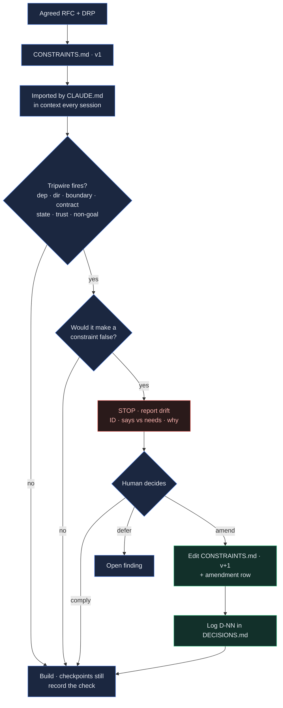
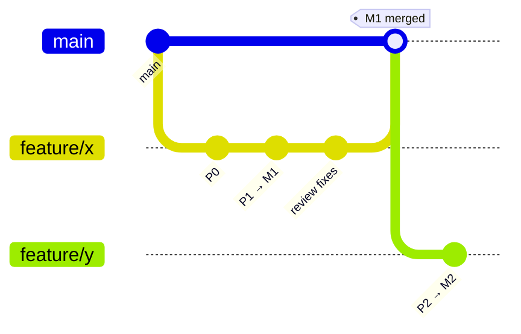
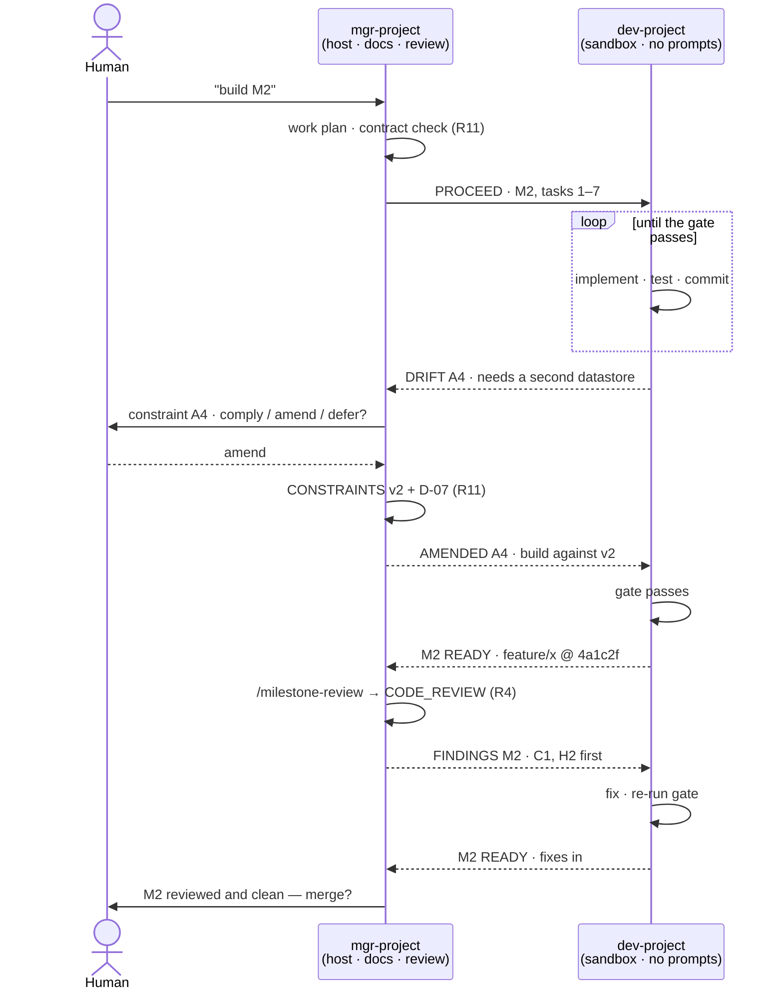

# Methodology — the lifecycle, artifacts, and rules

This is how we take a project from an idea to shipped, reviewed code. It is
documentation-first and evidence-driven: every build traces to a written proposal, and
every claim traces to a reproducible measurement.

---

## 1 · The artifact pipeline

Each stage produces a durable artifact in `docs/`. Later stages reference earlier ones
(provenance), so anyone can walk from shipped code back to the vision that motivated it.

| # | Stage | Artifact | Format | Answers |
|---|-------|----------|--------|---------|
| 1 | **Vision** | `BLOG_<topic>.html` | HTML | Why this? For whom? What changes? Plus the **product frame**: segments · jobs · success metric · launch criteria |
| 2 | **Proposal** | `<NAME>_RFC.html` | HTML (slides) | What do we assemble / build / avoid? Key decisions? Phased plan? |
| 3 | **Requirements** | `<NAME>_DRP.md` | Markdown | Detailed requirements, constraints, acceptance criteria, non-goals. **Engineering-owned — not a PRD** (see below) |
| 4a | **Design** | `<NAME>_ARCHITECTURE.html` | HTML | How is it built? Components, data model, boundaries |
| 4b | **Change** | `<NAME>_CHANGE_REQUEST.md` | Markdown | A scoped change on top of an existing architecture |
| 5 | **Plan** | `<NAME>_WORK_PLAN.md` | Markdown | Phases → milestones (M1…) → tasks, with **test gates** |
| 6 | **Milestone review** | `<NAME>_CODE_REVIEW.md` | Markdown | Findings by severity (C/H/M/S) for the milestone's diff |
| 7 | **Checkpoint** | `PROJECT_REVIEW_<date>.md` | Markdown | Project-level health; prioritized open findings; `✅ FIXED` tracking |
| — | **Contract** | `CONSTRAINTS.md` | Markdown | The top-level architecture in ~15 falsifiable sentences. Loaded every session; drift from it stops the build (R11) |
| — | **Running log** | `DECISIONS.md` | Markdown | Every non-trivial choice + rationale (ADR-lite) |
| — | **Map** | `DOCS_INDEX.md` | Markdown | Index of everything in `docs/` |

Templates for all of these live in [`templates/`](templates/).

### How the stages connect

- A **BLOG** can spawn one or more **RFCs**. An RFC always cites its BLOG.
- **ARCHITECTURE** is written once per system; **CHANGE-REQUEST** is used for every change
  after the architecture exists (it references the architecture section it touches).
- The moment the **RFC + DRP are agreed**, that agreement is compressed into
  **`CONSTRAINTS.md`** — the architecture contract every later decision is checked against (R11).
- The **WORK PLAN** turns the DRP + architecture into phases and milestones. Nothing gets
  built that isn't a task in the plan.
- Each **milestone** ends with a **CODE REVIEW**; the project periodically gets a
  **CHECKPOINT REVIEW**.

### The DRP is not a PRD — and where a PRD fits if you have one

This trips people up on first contact, so it is worth stating plainly. **DRP = Detailed
Requirements & Plan**: the *engineering* requirements specification — roughly an SRS for the
requirements half plus design detail for the rest. It carries the file-system layout, the pinned
library table, the integrations (with their timeout/retry/breaker policies) and the cross-cutting
concerns (R10). No product manager writes a circuit-breaker threshold. **It is owned by
engineering, and the people who write it are the people who write the RFC** — which is exactly
what makes co-authoring them the right default.

A **PRD** (Product Requirements Document) is a different artifact at a different altitude: the
problem, the personas, the user stories, the success metrics, the release criteria. If your
organisation has one, it sits **upstream as an input** — it informs the BLOG and the RFC, and it
is **never co-authored with the RFC**, because product decides *what and why* while the RFC/DRP
pair decides *how*. Confusing the two produces the objection people actually raise: *"why would a
PM co-author an engineering proposal?"* They wouldn't.

```
[PRD — product-owned, optional, upstream]
        │  maps onto the product frame + the DRP's F1…Fn
        ▼
 ① BLOG ─▶ ② RFC ⇄ ③ DRP ─▶ CONSTRAINTS ─▶ ④ ARCHITECTURE ─▶ ⑤ WORK PLAN
   └ product frame ┘   └ engineering-owned pair ┘
```

**The product tier is a section, not a stage.** Rather than a separate optional document — which
would duplicate most of the BLOG, and which teams would quietly route around (weakening R1) — the
BLOG carries a mandatory **product frame**: **segments** (named and sized) · **jobs** (*when … I
want to … so that …*, no solution named) · **success metric** (one business number as baseline →
target → by when, plus a guardrail that must not move) · **launch criteria** (what must be true to
roll out — not the same as milestone gates, which only prove the code correct).

Those four facts otherwise live nowhere: the BLOG's narrative implies them, and the RFC/DRP pair
is engineering-owned and carries none of them. With the frame in place, an incoming PRD has an
obvious landing site instead of a competing one — its content maps onto the frame plus the DRP's
`F1…Fn`, and the PRD stays the authority for anything in the frame so each fact keeps one owner
(R6). Without a product function, the BLOG carries the *why* and the DRP carries the *what* —
which is the common case, and nothing is missing.

### RFC & DRP are a coupled pair (not a strict hand-off)

The RFC (approach) and DRP (detail) depend on each other, so **co-author them** — this is
the default. The invariant is only that *approach and detailed requirements are agreed
together **before** the WORK PLAN*; how you get there is a size/fidelity choice:

Both are engineering documents with the same authors — that is the premise the whole rule rests
on. (A PRD is not one of these two; see above.)

| Mode | When | How |
|------|------|-----|
| **Parallel / co-authored** ★ | Most real work — approach and detail are entangled | Draft both together: **RFC leads on approach** (assemble/build/avoid, decisions), **DRP leads on detail** (testable requirements, acceptance criteria). One review covers both. |
| **Sequential** (RFC → DRP) | Approach is contested; you want cheap sign-off first | Get the RFC agreed, then write the DRP for the agreed direction |
| **Merged** | Small feature | One RFC with a "Detailed requirements" section; skip the separate DRP |

Cross-check continuously: a requirement no approach satisfies cheaply → revisit the RFC; an
approach that drops a requirement → fix the DRP. Log any direction change in `DECISIONS.md`.

---

## 2 · The rules that make it work

These are the parts people skip that cause the method to fail. They are not optional.

### R1 — Docs before code
No build starts without an RFC/DRP and a work-plan task. If you discover work mid-build,
add it to the plan first (a one-line task is fine) so the plan stays the source of truth.

### R2 — Every claim is measured
Any statement about performance, accuracy, latency, cost, or "X is better than Y" ships
with a **reproducible harness** in `scripts/` (or `scripts/<name>_bench/`) and the numbers
in the doc. If you can't measure it, mark it a **hypothesis**, not a finding. Prefer an
honest null result ("parity") over an unverified win.

### R3 — Every milestone has test gates, and every gate names what it proves
A milestone is not "done" because the code exists. It's done when its **test gate** passes —
an explicit, listed set of tests/assertions in the work plan. Gates are written *with* the
milestone, not after.

**Gates cite requirement IDs.** Each gate line names the DRP requirements it proves
(`gate (M2): … — proves F3, F4, NFR-latency`). That makes the chain
**requirement → acceptance criterion → gate → review** walkable in both directions: forward,
"what must this prove?"; backward, "if this test is deleted, which requirement just became
unverified?". A checkpoint can then ask the question that otherwise never gets asked — *which
requirements have no gate?* Requirements are `F1…Fn` (functional) and `NFR-<attribute>`
(non-functional, R13); an unreferenced requirement at the last milestone is a finding, not an
oversight.

### R4 — Review before advancing
Run a code review at the end of each milestone before starting the next. Findings are
triaged by severity (Critical / High / Medium / Security) and either fixed or logged as an
open finding in the next checkpoint.

### R5 — Branches; never merge to main unverified, and never merge what you can't undo
Work on `feature/<name>` branches. Do not merge to `main` until the milestone's gate passes
and the review is clean. Commit and push only when the human asks. The full flow — branch,
commit, push, PR, merge — is **§3 · The GitHub cycle**.

The fifth merge condition is **reversibility**: the PR says how the change is undone, because
code rolls back in seconds and data does not. Schema changes are expand-then-contract and the
`drop` lands in a separate, later PR — a migration never merges alongside the code that depends
on it. The mechanics are in §3.

### R6 — Docs are honest and current
The **final** doc describes the destination, not the journey — remove cancelled ideas and
detours (keep those in `DECISIONS.md` if they carry a lesson). Every "today" claim is read
from the repo as it stands. When a measurement corrects an earlier belief, fix the doc.

### R7 — Decisions are logged, not re-litigated
When a non-trivial choice is made (or reversed), add an entry to `DECISIONS.md` with the
context, options, choice, and why. This prevents re-opening settled questions.

### R8 — Persist what's non-obvious
Keep project memory (goals, constraints, decided calls, gotchas) that isn't derivable from
the code or git history. Don't persist what the repo already records.

### R9 — In planning, ask when unsure — with options
During the **planning stages** (initial discussion, RFC, DRP) don't guess at ambiguous
scope, requirements, or approach. **Ask the person a clear question and present suggested
options** — recommended one first, each with its trade-off — so they can choose fast instead
of writing prose. Resolve the ambiguity *before* finalizing the artifact, and record the
chosen answer in `DECISIONS.md`. Guessing is cheapest to fix here and most expensive to fix
later — so this is where questions pay off most. (In the build stages you act on the decided
spec; if a genuine ambiguity surfaces there, add it to the plan and, if it changes direction,
ask.)

### R10 — Design docs name the layout, the libraries, the integrations, and what already exists
Every architectural artifact (RFC, DRP, ARCHITECTURE, CHANGE_REQUEST) must carry four
concrete sections, not prose gestures at them:

1. **Code file-system layout** — the directory tree as it will exist, with what each path
   owns. A reader should know where a new file goes without asking.
2. **External libraries** — every proposed dependency by name, with version/pin, what it's
   for, and why it over the alternative. Unlisted dependencies don't get added mid-build;
   they go through the plan (R1).
3. **Integrations — inbound and outbound.** Two tables, because they fail in opposite
   directions:
   - **Inbound** (contracts we expose): protocol/style, who consumes it, version and
     compatibility policy, authN/authZ, idempotency semantics, rate limits, and the error
     shape. An exposed contract is the most expensive thing in the system to change, because
     we don't control who depends on it.
   - **Outbound** (services we call): the dependency, its published SLA/latency, **timeout,
     retry policy, breaker threshold, fallback, and the terminal state** a request ends in
     when all of that fails. One row per dependency — a global "we'll add retries" is not an
     answer. A design without this table has silently chosen *hang forever, then cascade*.

   "None" is a valid answer to either table; say it explicitly rather than omitting it.
4. **Cross-cutting concerns** — decided once, applied everywhere, and named here so an audit
   or an incident isn't the first time they're discussed: authN/authZ model · secrets and
   rotation · observability (structured logs with a correlation id, metrics, traces, the SLO)
   · configuration and its validation · tenancy · **data classification** (which fields are
   personal or regulated, and what that forces: encryption, log redaction, residency,
   retention and erasure) · audit trail · feature flags · cost model. One line each is enough;
   silence is not.

Two conditions attach to this:

**Python projects — ask which dependency manager.** Never assume. Ask (R9-style, with
options): **conda** is the house default; `uv`, `poetry`, and `pip` + `venv` are the usual
alternatives. Record the answer in `DECISIONS.md` and name it in the doc — the layout
section then shows the real file (`environment.yml`, `pyproject.toml`, `requirements.txt`).

**Existing codebase — inventory first, reuse hard.** When the work starts from code that
already exists, the design must open with what's there: the current layout, the libraries
already installed and actually used, the databases, and the live integrations. Build on
them. **Do not introduce a second library, service, or module that duplicates functionality
already present** — one HTTP client, one ORM, one test runner, one config loader. If you
genuinely must replace an incumbent, say so explicitly, justify it, and plan the removal of
the old one in the same work plan; a half-migration that leaves both is the failure mode
this rule exists to prevent.

### R11 — The architecture contract is checked, not remembered
The agreed top-level design is compressed into **`docs/CONSTRAINTS.md`** — the *contract*. A
long build drifts one reasonable-looking local decision at a time; the contract is what makes
each of those decisions checkable while it's still cheap.

**What it is.** One page, hard-capped: ~15 constraints, each a **falsifiable sentence** you can
hold against a diff and call true or false (`A1…An`), plus **non-goals**, **tripwires**, and an
**amendment log**. Not a summary of the architecture — the parts that, if violated, mean we are
building a different system than the one agreed. Anything you wouldn't stop the build over is a
detail and belongs in the DRP. It carries no diagrams and no history: it is a control file that
sits in context every session, and every line costs.

**Who writes it, when.** Created the moment the **RFC + DRP are agreed** — that's the first
point where a top-level design exists to hold anyone to. The **ARCHITECTURE** extends it (adding
constraints its design commits to); a **CHANGE-REQUEST** never silently contradicts it.

**Extension is not amendment.** These are different acts and the contract records them
differently — conflating them makes the normal work of the design stage read as drift:

| | **Extension** | **Amendment** |
|---|---|---|
| What happens | A **new** constraint ID is added (`A11`…). Nothing already in force changes. | An **existing** sentence's meaning changes, or a constraint is retired. |
| When | The ARCHITECTURE stage, mostly — the RFC/DRP agreed a shape, and the design commits to specifics it couldn't state yet. | Any time the build needs something the contract forbids. |
| Protocol | Just add it, at the artifact's closing checkpoint. Bump the version. No drift report — nothing became false. | The **full drift protocol**: stop, report, human decides comply / amend / defer. |
| Recorded as | A row in the log marked `ext`. | A row marked `amend`, plus a `D-NN` in `DECISIONS.md`. |

The test is mechanical, and it's the same test as everywhere else in R11: **did a sentence that
was true become false?** If no — extension. If yes — amendment, and the build stops first.

**When the agent reads it** — three layers, because "check on serious decisions" is not a trigger
anything can execute:

1. **Always resident.** `CLAUDE.md` imports it (`@docs/CONSTRAINTS.md`), so it is in context from
   the first token of every session. The one-page cap is what buys this. No recall step, no
   judgment call about whether this decision is "serious enough" to go look.
2. **Written checkpoints** — the check is *recorded*, not merely thought, at four fixed points:
   closing any architectural artifact (RFC · DRP · ARCHITECTURE · CR), **starting each
   milestone**, every **CODE REVIEW** (a Contract-check section: each constraint `held` /
   `drifted` / `n/a`), and every **CHECKPOINT REVIEW**.
3. **Tripwires** — the event-driven layer, and the one that catches real drift. The contract
   lists the concrete edits that force a re-read *before* the edit: a new dependency, service or
   datastore · a new top-level directory or deployable · crossing a stated boundary · changing a
   public contract (API, schema, CLI, event, file format) · introducing state, concurrency,
   caching or background work · changing the auth/tenancy/trust model or deployment target ·
   a second tool for a job something already does (R10) · anything on the non-goals list.

The test that makes all of this executable: **if the change would make a sentence in
`CONSTRAINTS.md` false, stop.** That is a text-consistency check, not a judgment call — which is
exactly why it survives a long session.

### R12 — One human interface
The human talks to **exactly one session**. That session — the **manager** — owns every document,
every review, and every call that needs a person. Any other session (a **developer** building
against the plan) reports to the manager and waits. It never asks the human directly, and it never
invents an answer to keep moving.

Four things force a report, and nothing else does: a **finished milestone**, a **blocker**, a
**contract drift** (R11), and **work the plan doesn't have** (R1/R10). Between those, the developer
builds without stopping.

Why the rule exists: there are two different bottlenecks and they want opposite treatment. Judgment
is limited by *human attention* — it gets better when every question arrives in one place, in
order, to someone with the docs open. Typing is limited by *permission prompts* — it gets better
when nothing needs approving at all. One session can't be optimised for both. Split them and each
gets what it needs.

A single-session project satisfies R12 trivially: that session is the manager. The two-session
shape the rule governs is **§8**.

**The drift protocol (mandatory).** On a violation the agent **must not implement and then
mention it**. It stops and reports: the **constraint ID**, what the contract says, what the change
needs, why the change is being proposed, and options — **comply** (fit the contract),
**amend** (change the contract), **defer** (park it as an open finding). Then it waits for a human
decision. If the amendment is approved: edit `CONSTRAINTS.md` **first** (bump the version, add an
amendment row), log a `D-NN` in `DECISIONS.md` (R7), then build. Contract changes never arrive as
a side effect of a commit.



### R13 — Non-functional requirements are numbers, and every number has a gate
Functional requirements decide *what* gets built. Non-functional ones decide *how* — and they
are the ones that get left as adjectives. "Fast", "reliable", "highly available", "real-time"
and "it must scale" are not requirements; they are places where a requirement is missing.

**Every quality attribute the system is held to gets a row in the DRP**, with four columns and
no blanks:

| Attribute | Target | Measured by | Gate |
|-----------|--------|-------------|------|
| Latency | p99 ≤ 800 ms at peak | `scripts/bench_checkout/` — p99 of `POST /orders` at 240 w/s for 10 min | M4 |
| Availability | 99.9% monthly | synthetic probe on the checkout path, 1/min | — (ops, not a gate) |
| Durability | RPO 0 · RTO 5 min | rehearsed failover, timed, quarterly | M3 |

The attributes to walk, so none is silently dropped: **latency** (with the percentile —
p99 is where architecture lives) · **throughput** (peak, not average) · **availability** ·
**durability** (RPO/RTO) · **consistency** (how eventual, in seconds) · **security &
privacy** · **observability** · **operability** · **cost**. Not every one applies; the ones
that don't are written as *n/a, because …* rather than omitted.

Three conditions:

**A target with no measurement method is a wish.** The "measured by" column names a runnable
harness in `scripts/` (R2) or a specific probe — not a person's judgement. If it can't be
measured, it's a **hypothesis**, and it is labelled one.

**Every NFR with a number gets a milestone gate.** This is where R2 and R3 meet, and it is the
join people skip: R2 governs claims you *make*, R3 governs milestones — so an unmeasured
*target* falls between them and nothing ever proves it. A performance target with no
performance gate is a target nobody will discover was missed until production does. The gate
may be its own milestone (`M4 · scale proof`) when the number can only be shown late.

**Ask for the number; never invent it.** During planning, an unspecified quality attribute is
an R9 question with options attached — "three nines or four? Four roughly triples the
infrastructure and puts someone on call" — not a default quietly chosen by whoever writes the
doc. Record the answer in `DECISIONS.md`, then in the table.

Constraints that a diff can falsify are promoted to `CONSTRAINTS.md` (R11); the rest stay in
the DRP. Most NFRs stay in the DRP — a latency budget is a target to measure, not a sentence a
diff makes false.

---

## 3 · The GitHub cycle

How code moves from a feature branch to `main`. This makes R5 concrete.

### Branches
- **`main`** is always releasable and green. Never commit directly to it.
- One branch per RFC/feature: **`feature/<name>`** (match the RFC name), cut from an
  up-to-date `main`.
- Small fixes outside a feature: **`fix/<name>`**. Urgent production fix: **`hotfix/<name>`**
  off `main`, fast-tracked review, merged back and tagged.

### Commits
- Commit **granularly, as tasks land** — one coherent change per commit. The subject
  references the work-plan task/milestone (e.g. `feat(engine): P1 ingress loop → M1`).
- Every commit builds; don't commit broken intermediate states on shared branches.
- Trailer on every commit: `Co-Authored-By: …` per project convention.
- **Commit and push only when the human asks** (interactive work). Don't auto-push.

### When to push
- Push the `feature/<name>` branch **once the first milestone's work exists** (back it up,
  enable review) and **after each milestone** thereafter.
- Push before requesting a review, so the reviewer sees the exact branch state.

### When to open a PR
- Open a **draft PR** at the first push (visibility), or a **ready PR** at a milestone.
- PR body links the **RFC/DRP**, the **work-plan milestone**, and the **code review**; lists
  the test gate and its result.

### When to merge (the gate)
A `feature/*` branch merges to `main` **only when all hold**:
1. The milestone/feature **test gate passes** (R3).
2. The **code review is clean** — no open Critical/High (R4).
3. CI is green (if configured).
4. The PR is approved.
5. **It is reversible** — the PR says how this is undone, and the answer isn't "restore from
   backup".

Condition 5 exists because code rolls back in seconds and data does not. Anything irreversible
is split so that the irreversible half lands last, on its own, after the rollback window has
closed:

- **Schema changes are expand-then-contract.** Add the new column/table, backfill, switch
  reads, *then* drop the old one — four deploys, and the drop is a separate PR days later.
  A migration and the code that depends on it never merge together.
- **A destructive migration ships with its down-path** — a tested rollback script, or a copy of
  what it deletes, retained past the rollback window.
- **Behaviour that can't be un-deployed** (a published event shape, an outbound webhook, an API
  field) is additive-only, or goes behind a flag that defaults off.
- **Risky changes go behind a feature flag**, so reverting is a config change rather than a
  deploy — and the flag's removal is a task in the plan (R1), not an intention.

If none of that applies, the PR says **"reversible: plain revert"** — one line. The point is
that it was considered, in the open, before the merge and not during the incident.

Prefer **squash-merge** for a clean, linear `main` (one commit per milestone/feature),
unless the project decides otherwise. Delete the branch after merge. Tag releases
(`vX.Y.Z`) when `main` reaches a shippable point.



### The rule of thumb
**Branch per feature · commit per task · push per milestone · merge per passed-gate-and-clean-review.**

---

## 4 · House style (visual consistency)

All HTML artifacts (BLOG, RFC, ARCHITECTURE) use the shared design system in
[`assets/house.css`](assets/house.css): a dark theme with a fixed token palette
(`--bg`, `--a` blue, `--b` teal, `--c` amber, `--ctrl` violet, `--danger`, `--ok`,
`--pt` brand orange) and a small component vocabulary (`.card`, `.callout`, `.pill`,
`.kicker`, `.grid`, `.tablewrap`, `.deck`).

**Every substantive artifact is illustrated** — this is a house rule, not a nicety:

- **HTML docs** (BLOG, RFC, ARCHITECTURE): **inline SVG** using the house tokens — colorful,
  no external libraries, no raster images for anything structural.
- **Markdown docs** (DRP, CHANGE-REQUEST, WORK PLAN, reviews): **mermaid** fenced blocks
  (```` ```mermaid ````) — flowcharts, sequence, state, gantt, class diagrams. These render
  on GitHub and in most viewers.

At least one diagram per artifact; prefer one per major section. A diagram that encodes the
real structure beats prose describing it.

App UIs (not docs) use [`frontend-kit/`](frontend-kit/): the same tokens exposed as a
buildless HTML/CSS component kit.

**Presentations** use [`templates/DECK.template.html`](templates/DECK.template.html) — the same
tokens again, as a **single self-contained file**: inlined CSS and JS, inline SVG, no CDN and no
webfont link, so it opens from a USB stick or an offline laptop. It carries two modes in one
document — *present* (one slide at a time, arrow keys, overview grid, fullscreen) and *reference*
(everything stacked, sticky TOC, `Ctrl+F`) — plus Print → PDF. `templates/tools/deck_to_pptx.py`
exports it to a native 16:9 PowerPoint, re-rendering each inline SVG at high resolution; the HTML
stays the source of truth. Written by `/write-deck`.

---

## 5 · Naming conventions

```
BLOG_<TOPIC>.html                 BLOG_PLATFORM_ARCHITECTURE.html
<NAME>_RFC.html                   PAYMENTS_RFC.html
<NAME>_DRP.md                     PAYMENTS_DRP.md
<NAME>_ARCHITECTURE.html          PAYMENTS_ARCHITECTURE.html
<NAME>_CHANGE_REQUEST.md          BILLING_CHANGE_REQUEST.md
<NAME>_WORK_PLAN.md               PAYMENTS_WORK_PLAN.md
<NAME>_CODE_REVIEW.md             PAYMENTS_CODE_REVIEW.md
PROJECT_REVIEW_<YYYY-MM-DD>.md    PROJECT_REVIEW_2026-07-06.md
CONSTRAINTS.md  DECISIONS.md  DOCS_INDEX.md
```

Milestones are `M1, M2, …`; phases are `P0, P1, …`; review findings are `C1/H1/M1/S1`
(Critical/High/Medium/Security); architecture constraints are `A1, A2, …` and decisions
`D-001, D-002, …`.

---

## 6 · The progress trace

There is no separate "status" tool. The trace *is*:

1. **Work-plan checkboxes** — `- [ ]` / `- [x]` per task, `→ **M2**` milestone markers.
2. **Milestone code reviews** — one per milestone, dated.
3. **Checkpoint reviews** — periodic, with `✅ FIXED` annotations on prior findings.
4. **`DECISIONS.md`** — the why behind course changes.
5. **Git history** on the feature branch.

Anyone can reconstruct where the project is from these five, without a meeting.

`CONSTRAINTS.md` is not part of the trace — it describes the *destination*, always in the
present tense (R6). Its **amendment log** is the exception: it records every approved change of
direction, and pairs with the `D-NN` entry that explains why.

---

## 7 · Using the skills

The `.claude/skills/` here automate each stage against these templates:

| Skill | Does |
|-------|------|
| `new-project` | Scaffolds `docs/`, copies templates + `house.css`, seeds `DOCS_INDEX.md` + `DECISIONS.md` |
| `write-blog` | Generates a house-style BLOG from a topic |
| `write-rfc` | Generates a slide-style RFC (assemble/build/avoid · decisions · phases · risks) |
| `write-drp` | Generates a Detailed Requirements & Plan |
| `write-rfc` / `write-drp` | Whichever finishes second seals the agreement into `CONSTRAINTS.md` (R11) |
| `write-architecture` | Generates an ARCHITECTURE doc (or a CHANGE-REQUEST); extends the contract |
| `make-workplan` | Turns a DRP/architecture into phases, milestones, tasks + test gates + per-phase contract checks |
| `milestone-review` | Runs a code review + contract check; updates the progress trace / checkpoint. In §8 mode it's also the manager's answer to an `M<n> READY` signal |
| `write-deck` | Generates a **self-contained dual-mode HTML presentation** (present + reference in one file, no build, no network) from `templates/DECK.template.html`; optional PowerPoint export via `templates/tools/deck_to_pptx.py`. Not a pipeline stage — it's for the times an artifact has to be *presented* rather than read |

### Reuse before building
R10 applies to the method itself: where Claude Code already does something well, the skill
**calls it** and keeps only what's ours — the templates, the tokens, the severity scheme,
the trace.

| Stage | Delegates to | The house keeps |
|-------|--------------|-----------------|
| Drawing a section's SVG (blog/rfc/architecture) | `artifact-diagramming`, `dataviz` | house tokens, template structure |
| The R10 inventory of existing code | **`Explore`** agent | the layout tree + library table |
| Weighing design alternatives | **`Plan`** agent | the trade-offs table, what was rejected |
| Finding issues in a milestone diff | `/code-review`, `/security-review`, `simplify` | C/H/M/S IDs, verify-before-reporting, the trace |

There's no per-stage enable hook, and none is wanted: `skillOverrides` is static per project
while a project passes through every stage. Each `SKILL.md` names what to call and when —
explicit and debuggable. The SessionStart banner already detects the stage from what exists
in `docs/`. **Not** reused: the per-session task list for work plans — the checkboxes are the
durable cross-session trace, and mirroring them would create two sources of truth (§6).

### Getting it into a project, and keeping it there

| Command | When | Does |
|---------|------|------|
| `./install.sh` | once | Symlinks the skills into `~/.claude/skills` — updates propagate. `--copy` freezes them. |
| `./new-project.sh <dir>` | day one | Bootstraps unattended. `--name` (defaults to the directory name), `--description`, `--dry-run`, `--yolo`. |
| `./install.sh --new-project <dir>` | day one | Both, in one command. |
| `./sync-project.sh <dir>` | after a method change | Refreshes copied templates/`house.css`/methodology **and the kit's live `.claude/hooks` + `.claude/roles` executables**; reports what needs a hand-merge. |
| `.claude/roles/manager.sh` · `developer.sh` | when a build is long enough to want two sessions | Starts the manager (host) / developer (sandbox) sides of §8. Installed by `new-project`, inert until used. |

Two couplings, on purpose: skills are **symlinked** so a methodology change reaches every
project at once; templates and `house.css` are **copied** so a project stands alone if the kit
moves — at the cost of drift, which `sync-project.sh` repairs. It never touches an authored
artifact.

Bootstrapped projects also grant `Read`/`Edit`/`Write` on `docs/**` in `.claude/settings.json`,
so artifact authoring doesn't prompt; code changes still do. The grant is inactive until the
workspace is trusted. `new-project.sh` runs scoped (`--permission-mode acceptEdits` plus the
scaffold's shell commands), not as a blanket bypass — `--yolo` is that, and it isn't confined
to the target directory.

---

## 8 · The two-session split (manager · developer)

R12 says the human talks to one session. This is the shape that makes that pay off: **two
sessions, one repo, different jobs and deliberately different permission levels.**

An agent that is both writing the docs and typing the code stops constantly — for permission, for
a question, to show you something. Most of those stops don't actually need *you*; they need a
decision from someone holding the plan. So separate the two. One session holds the documents, the
reviews and the human. The other holds nothing but the current milestone, and runs flat out inside
a sandbox where nothing needs approving.

This is a **mode, not a requirement** — small work stays single-session (see *The degenerate case*
below). It earns its keep once the build is long enough that permission prompts, rather than
thinking, are what's slowing it down.

### Who owns what

| | **Manager** — host, normal permissions | **Developer** — sandbox, `--dangerously-skip-permissions` |
|---|---|---|
| **Talks to** | the human — the only session that does | the manager — the only session it talks to |
| **Owns** | everything in `docs/`: BLOG · RFC · DRP · CONSTRAINTS · ARCHITECTURE · CR · WORK PLAN · CODE REVIEW · CHECKPOINT · DECISIONS · DOCS_INDEX | the code and its tests |
| **Does** | plans, reviews each milestone (R4), amends the contract (R11), logs decisions (R7), answers the developer's questions | implements plan tasks, writes tests, runs the gate, commits granularly on the feature branch |
| **Runs** | the servers — on the **host**, always bound to `0.0.0.0` | test processes only, inside the sandbox |
| **Handles** | integration, environment, cross-service and "it works for you but not for me" problems | the milestone in front of it, and nothing else |
| **Never** | reaches into the working tree mid-milestone — findings go back as *findings* | edits `docs/`, messages the human, or decides anything on its own |

The asymmetry is the whole design: the developer has **more machine permission and less
authority**. It can do anything to the sandbox and nothing to the plan.

**Servers belong to the manager**, and this is mechanical rather than stylistic: the sandbox
publishes no ports, so a server started inside it is invisible to the human's browser — and we
work remotely, so `localhost` is invisible too. The manager starts long-lived servers on the host
bound to `0.0.0.0`. Short-lived test servers inside the sandbox, torn down by the test that
started them, are the developer's business and stay there.

### The four signals that stop the developer

Each message opens with its tag on the first line, so the manager can triage without reading
prose:

| Signal | Fires when | Carries |
|--------|-----------|---------|
| `M<n> READY` | the milestone's test gate passes (R3) | branch + commit sha · the gate command and its result · **the plan task IDs it completed** · what changed in a sentence. **Requests the review** (R4). |
| `BLOCKED` | it cannot proceed | what's blocked · what was already tried · what it needs from the manager |
| `DRIFT A<n>` | an R11 tripwire fired and the change would make a constraint false | constraint ID · what the contract says · what the change needs · why · comply / amend / defer |
| `PLAN GAP` | the work needs a task the plan doesn't have (R1), or a dependency not in the library table (R10) | what's missing · the task or dependency it proposes · what it would displace |

Everything else, it just does.

**Having sent a signal, the developer stops.** It does not start the next milestone and it does not
find a smaller task to fill the wait. The value of a checkpoint is that the code being reviewed
isn't moving while it's reviewed.

### The manager's replies

| Reply | Means |
|-------|-------|
| `FINDINGS M<n>` | review done — path to the `CODE_REVIEW`, the Critical/High list, the order to fix them in |
| `PROCEED` | cleared to continue — the next milestone, or the next task |
| `ANSWER` | the question is decided (with the `D-NN` if it was worth logging) |
| `AMENDED A<n>` | the contract changed — new version, what changed, build against it now |

The loop is: **build → signal → wait → fix → build.** Only the manager's side of it is visible to
the human, and that is the point of R12.

### The wire

Sessions address each other by **name**, so both sides get a fixed one:

```bash
mgr-<project>     # manager, on the host
dev-<project>     # developer, in the sandbox
```

`claude -n <name>` sets it. `ListAgents` lists the peers a session can see; `SendMessage` addresses
one by name. The launchers in `.claude/roles/` set the names, so neither side has to discover
anything.

**Messages are signals, not payloads.** Both sides see the same working tree and the same git
history, so a message carries a tag, a pointer, and a sentence:

```
M2 READY · feature/ingest @ 4a1c2f · gate: pytest -q tests/ingest → 34 passed
done: P2.1 P2.2 P2.4 · not done: P2.3 (deferred — see BLOCKED earlier)
Backfill path is in; the retry budget is per-batch, not per-record — worth a look in review.
```

Never paste a diff. The repo is the channel; the message says where to look.

**Why the task IDs are on the wire.** The work-plan checkboxes are the progress trace (§6), and
the developer never edits `docs/` — so without them the trace lags a whole milestone behind
reality and the manager has to reconstruct what landed from the git log. The `done:` /
`not done:` line makes ticking the boxes a transcription rather than an investigation, and it
surfaces the more useful fact: a task the plan has that the milestone *didn't* do. The manager
ticks the boxes as part of the review, before replying.

### What the sandbox has to provide

Three requirements, and they exist so the messaging works at all:

1. **The same repo at the same path** on both sides — otherwise a pointer in a message doesn't
   resolve.
2. **A shared `~/.claude`** — that's where sessions register themselves (`sessions/<pid>.json`).
3. **A shared PID namespace and socket directory** (`$XDG_RUNTIME_DIR/cc-socks`) — liveness is
   checked against `/proc/<pid>`, so without this the host and the sandbox each prune the other's
   sessions as dead.

The reference implementation is a sibling repo, `claude-docker` — an Ubuntu image with the Claude
Code CLI whose `run.sh` mounts the work tree at its host path, shares `~/.claude`, and passes
`--pid=host` with the socket directory. Any sandbox meeting the three requirements works just as
well: a VM, a separate user account, a remote box.

Be honest about what it buys: a container that mounts your `~/.claude` and your source read-write
and shares the host PID namespace **reduces blast radius, it is not a security boundary**.
`--dangerously-skip-permissions` inside it is a bet that the agent won't wreck a directory you can
restore from git — not a bet that a hostile process can't escape.

### Running it

```bash
.claude/roles/manager.sh              # host: claude -n mgr-<project>
.claude/roles/developer.sh            # host: launches the sandbox, then dev-<project> inside it
.claude/roles/developer.sh --here     # already inside the sandbox (or don't want one)
```

Both are installed by `new-project` alongside `.claude/roles/MANAGER.md` and `DEVELOPER.md` — the
role briefs each session reads on startup. `CLAUDE_DOCKER=<path>` points the developer launcher at
your sandbox if it isn't `../claude-docker`.



### The degenerate case

One session on its own **is** the manager: it owns the docs, it talks to the human, R12 is
satisfied and §8 is simply off. Nothing in the pipeline changes — the artifacts, the gates and the
reviews are identical either way. The split changes *who* does each part, never *what* gets done.
