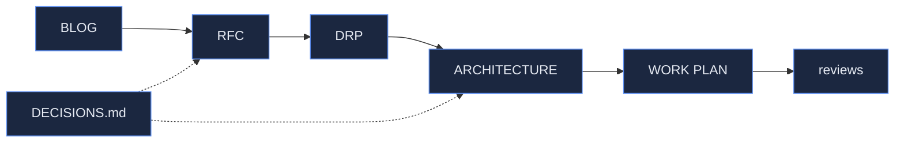

<!-- TEMPLATE: DOCS INDEX — the map of docs/. Keep current as artifacts are added.
     Ordered by pipeline stage so a newcomer can read top-to-bottom. -->

# {{PROJECT}} — Documentation Index

The map of `docs/`. Artifacts follow the pipeline: **BLOG → RFC → DRP → ARCHITECTURE/CR → WORK PLAN → reviews.**
See [../ONBOARDING/METHODOLOGY.md](../ONBOARDING/METHODOLOGY.md) for the method.

## Vision
- [BLOG_{{TOPIC}}.html](BLOG_{{TOPIC}}.html) — {{one line}}

## Proposal & requirements
- [{{NAME}}_RFC.html]({{NAME}}_RFC.html) — {{one line}}
- [{{NAME}}_DRP.md]({{NAME}}_DRP.md) — {{one line}}

## Design
- [{{NAME}}_ARCHITECTURE.html]({{NAME}}_ARCHITECTURE.html) — {{one line}}
- [{{…}}_CHANGE_REQUEST.md]({{…}}_CHANGE_REQUEST.md) — {{one line}}

## Plan & progress
- [{{NAME}}_WORK_PLAN.md]({{NAME}}_WORK_PLAN.md) — phases, milestones, tasks, gates
- [{{NAME}}_CODE_REVIEW.md]({{NAME}}_CODE_REVIEW.md) — milestone reviews
- [PROJECT_REVIEW_{{DATE}}.md](PROJECT_REVIEW_{{DATE}}.md) — checkpoints

## Reference
- [DECISIONS.md](DECISIONS.md) — decision log
- [{{other reference docs}}]({{…}})
