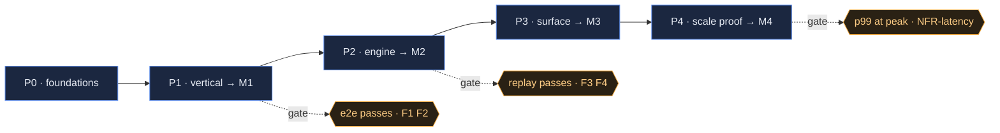

<!-- TEMPLATE: WORK PLAN. Stage 5. Turns the DRP + architecture into phases → milestones → tasks,
     each milestone with an explicit TEST GATE. The checkboxes are the progress trace.
     Markdown; illustrate with mermaid. Phases = P0/P1…; milestones = M1/M2…. -->

# {{NAME}} — Work Plan

- **Sources:** [{{NAME}}_DRP.md]({{NAME}}_DRP.md) · [{{NAME}}_ARCHITECTURE.html]({{NAME}}_ARCHITECTURE.html)
- **Contract:** [CONSTRAINTS.md](CONSTRAINTS.md) {{v1}} — every milestone opens with a contract check (R11)
- **Branch:** `feature/{{name}}`  ·  **Status:** {{in progress · P1}}

## Phase overview

Tasks are numbered `P<n>.<m>` so a milestone report can name exactly what it completed
(methodology §8). Every gate cites the DRP requirements it proves (R3).

| Phase | Theme | Ships | Milestone | Gate | Proves |
|-------|-------|-------|:---------:|------|--------|
| P0 | Foundations & contracts | {{schemas, stores, protocols}} | — | unit tests green | — |
| P1 | {{thin vertical}} | {{first end-to-end slice}} | **M1** | {{e2e test}} | {{F1, F2}} |
| P2 | {{engine}} | {{…}} | **M2** | {{…}} | {{F3, F4, NFR-consistency}} |
| P3 | {{surface}} | {{…}} | **M3** | {{…}} | {{F5, NFR-operability}} |
| P4 | {{scale proof}} | {{the measurement harness}} | **M4** | {{benchmark at peak}} | {{NFR-latency, NFR-throughput}} |

**Requirement coverage.** Every `F#` and numbered `NFR-*` in the DRP appears in the *Proves*
column at least once. An NFR with a number and no gate is the join R2 and R3 both miss — a
target nobody will discover was missed until production does (R13).

| Requirement | Proven by | |
|-------------|-----------|---|
| {{F1}} | {{M1}} | ✅ |
| {{NFR-latency}} | {{M4}} | ✅ |
| {{F7}} | — | ⚠️ deferred to {{phase / next RFC}} — deliberately, see {{D-NN}} |

---

## P0 · Foundations & contracts

- [ ] **P0.1** `{{path}}` — {{schema / dataclass}}
- [ ] **P0.2** `{{path}}` — {{store / protocol + default impl}}
- [ ] **P0.3** `test_{{…}}.py` — {{round-trip / invariant}}

**Gate (P0):** {{all unit tests green; no runtime wiring yet}}.

## P1 · {{Thin vertical}} → **M1**

- [ ] **P1.0 Contract check (R11)** — re-read `CONSTRAINTS.md`; this milestone's tasks touch
      {{A2, A6}} and stay inside them. {{Or: drift found → reported, see D-NN.}}
- [ ] **P1.1** `{{path}}` — {{the first real end-to-end path}}
- [ ] **P1.2** `{{path}}` — {{…}}
- [ ] **P1.3** `test_{{…}}_e2e.py` — {{input → assert the observable outcome}}
- [ ] **P1.4** {{determinism / idempotency assertion, if relevant}}

**Gate (M1):** {{the exact assertions that must pass}} — **proves {{F1, F2}}**.
**Review:** run `/milestone-review` → `{{NAME}}_CODE_REVIEW.md` (M1). Fix Critical/High before P2.
**Handoff (§8):** developer sends `M1 READY` (branch · sha · gate result · **`done:` the task IDs
completed, `not done:` any it didn't**) and **stops**; the manager ticks the boxes above, reviews,
and replies `FINDINGS M1` or `PROCEED`. Single-session? Same review, no message.

## P2 · {{Engine}} → **M2**

- [ ] **P2.0 Contract check (R11)** — constraints this phase touches: {{A#}}.
- [ ] **P2.1** `{{path}}` — {{…}}
- [ ] **P2.2** `test_{{…}}.py` — {{…}}

**Gate (M2):** {{…}} — **proves {{F3, F4}}**.
**Review:** code review; update checkpoint.
**Handoff (§8):** `M2 READY` + `done:` task IDs → wait for `FINDINGS M2` / `PROCEED`.

## P3 · {{Surface / UI}} → **M3**

- [ ] **P3.1** `{{path}}` — {{…}}
- [ ] **P3.2 UI:** {{screen / component, using the frontend-kit tokens}}
- [ ] **P3.3** `test_{{…}}.py` — {{…}}

**Gate (M3):** {{…}} — **proves {{F5}}**.
**Handoff (§8):** `M3 READY` + `done:` task IDs → wait for `FINDINGS M3` / `PROCEED`.

## P4 · {{Scale proof}} → **M4**

<!-- Every NFR carrying a number needs a milestone that measures it (methodology R13). Drop this
     phase only if every NFR is already proven by an earlier gate — not because it's inconvenient. -->

- [ ] **P4.1** `scripts/bench_{{…}}/` — the harness (R2): {{load profile · what it asserts}}
- [ ] **P4.2** {{run at peak for {{n}} min; record p99, throughput, error rate}}
- [ ] **P4.3** {{failover / rollback rehearsal, timed}}

**Gate (M4):** {{p99 ≤ {{n}} ms at {{n}}/s sustained {{n}} min, no queue growth}} —
**proves {{NFR-latency, NFR-throughput, NFR-durability}}**. Numbers recorded in the DRP §4 table.

---

## Definition of Done (every task)

- Code + tests committed on `feature/{{name}}`.
- **No constraint in `CONSTRAINTS.md` was made false** — or the drift was reported, approved,
  and the contract amended before the code landed (methodology R11).
- Milestone **gate passes**; **code review** clean (no open Critical/High).
- Any measured claim has a reproducible harness in `scripts/` (methodology R2), and every NFR
  target with a number has a gate that measures it (R13).
- **It is reversible** (methodology §3, merge condition 5): the PR says how this is undone.
  Schema changes are expand-then-contract — add, backfill, switch reads, and **drop in a
  separate later PR**. A migration never merges with the code that depends on it. Anything that
  can't be un-deployed is additive-only or behind a flag that defaults off; the flag's removal
  is a task here, not an intention.
- Docs updated; `DECISIONS.md` and `DOCS_INDEX.md` current — **by the manager** if two sessions
  are running (R12): the developer never edits `docs/`, and reports completed task IDs on the
  wire instead (§8) so the checkboxes above stay current without it.

## Progress trace

Update the checkboxes above as work lands. Milestone reviews and checkpoints record the
rest — no separate status doc.
